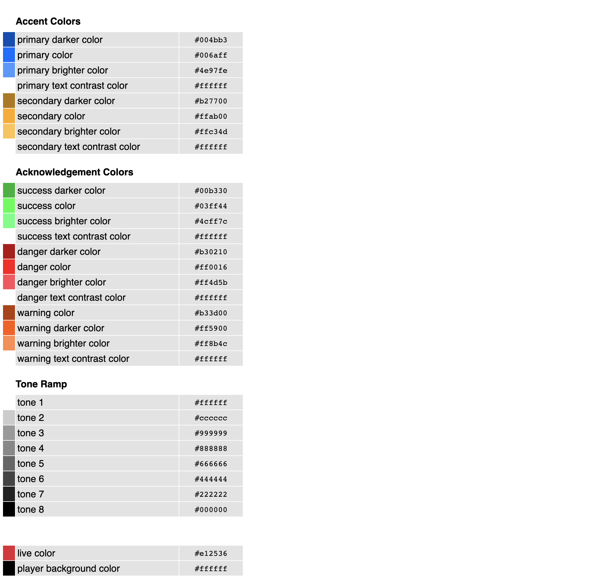

# Customize the player colors

in order to override the player default colors you can pass your own color (in HEX color format!) in the `ui` section in player config

> This guide assumes you are using the [Kaltura Player]

[kaltura player]: https://github.com/kaltura/kaltura-player-js/

### Example
```js
const config = {
  targetId: 'player-placeholder',
  provider: {
    partnerId: 1234567,
  },
  ui: {
    userTheme: {
      colors: {
        primary: '#da3633',
        secondary: '#c4da33'
      }
    }
  }
}

const player = KalturaPlayer.setup(config);
```
> Note: only HEX color format is excepted

[See here for full configuration options](https://github.com/kaltura/playkit-js-ui/tree/master/flow-typed/types/user-theme.js)

## Default Color Palette



Only the primary colors can be changed, the secondary colors are automatically derived from the primary color

The calculation is done in hsl color format **hsl(hue saturation lightness)**, where the first two components (hue saturation) remain the same and the last component (lightness) decreases or increases by 15 percent in lighter and darker colors accordingly


> **Note:** Currently only the **primary**, **live** and **playerBackground** colors are supported
