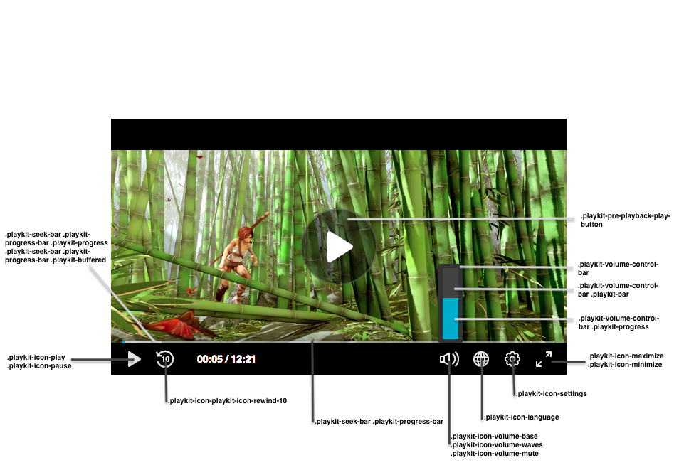

# Customizing the CSS
The player user interface is all made with HTML and CSS, which mean you can edit it as you wish as seen in this [demo](https://codepen.io/anon/pen/JMaObJ?editors=1100).

You can change the color of the scrubber, text fonts family, change the control icons and more!

> **Pay attention:**
> - The namespace for the default skin is 'playkit'.
> - The player use the same font family in all it's components. You can override it in the general parent class (`.playkit-player-gui`) or customize each component as you wish.

## Player Classes List

**Buttons**

|Class Name| Description |
|--|--|
| .`playkit-pre-playback-play-button` | The background of the play button, before the player started playing |
| `.playkit-icon-play` | The player icon. Is used in the bottom controllers and on the player itself |
|`.playkit-icon-start-over`| Start over icon. Shown at the end of the video|
| `.playkit-control-button` | The same for all the controllers icon buttons in the bottom control |
| `.playkit-icon-pause` | Pause icon |
| `.playkit-icon-playkit-icon-rewind-10` |Rewind icon  |
| `.playkit-icon-volume-base`| The left side of the volume icon |
| `.playkit-icon-volume-waves` | Shown when not on mute |
| `.playkit-icon-volume-mute` | Shown when the player is muted |
| `.playkit-icon-language` | Languages selection icon |
| `.playkit-icon-settings` | Settings icon |
|`.playkit-icon-maximize`  | Maximize icon |
| `.playkit-icon-minimize` | Minimize icon |

**Volume and Seek Bar**

| Class Name | Description |
|--|--|
| `.playkit-volume-control-bar` | Placeholder for the volume level |
| `.playkit-volume-control-bar .playkit-bar` | The background of the level |
| `.playkit-volume-control-bar .playkit-progress` | Indicated the audio level |
| `.playkit-seek-bar` | Placeholder for the player seek bar |
| `.playkit-seek-bar .playkit-progress-bar` | Placeholder for the actual progress bar |
| `.playkit-seek-bar .playkit-progress-bar .playkit-progress` | Indicates the progress of the video/audio |
| `.playkit-seek-bar .playkit-progress-bar .playkit-progress .playkit-scrubber` | Indicates the end of the progress bar. When seek bar is hovered, it will indicate the current position of the mouse on the seek bar |
| `.playkit-seek-bar .playkit-progress-bar .playkit-virtual-progress` | When hovering and seeking to a future part of the media, this will show the progress until this point |
| `.playkit-seek-bar .playkit-progress-bar .playkit-time-preview` | When hovering on the seek bar, it will show the current mouse position time |

**Overlays**

| Class Name | Description |
|--|--|
|`.playkit-bottom-bar`| Placeholder of all the bottom controllers|
|`.playkit-overlay .playkit-overlay-contents`| Overlays container, for advanced captions settings e.g. |
|`.playkit-overlay .playkit-error-overlay`| Overlay that pops up when there is an error|

**Spinner**

|Class name| Description |
|--|--|
|`.playkit-spinner`| Our spinner implementation. It is consisted of several span child elements which you can remove with: ` .playkit-spinner span{ display: none;}` |
