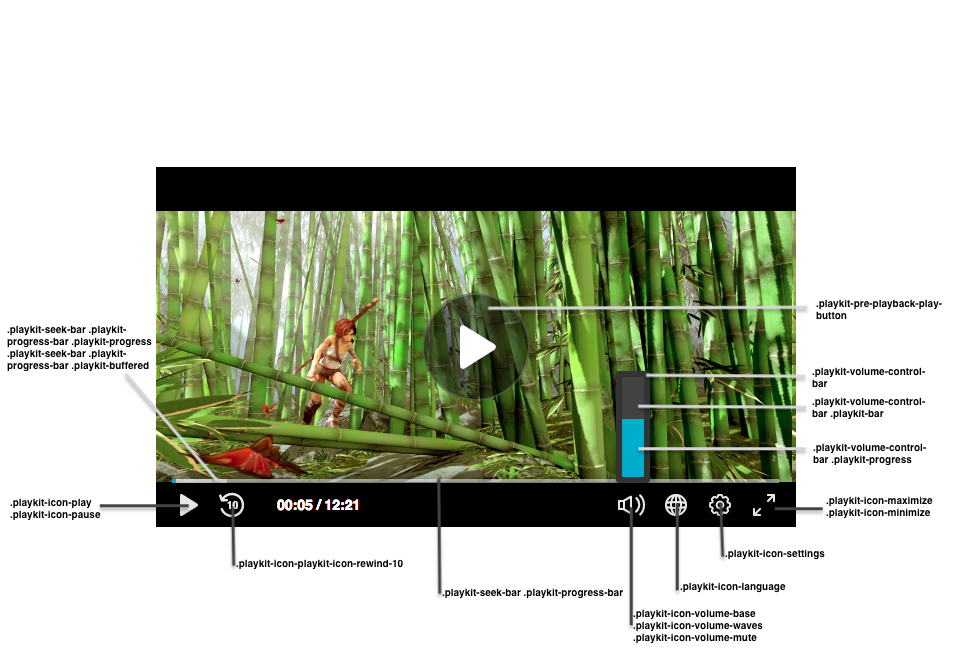

# Customizing the Player CSS
The player user interface (UI) is created using HTML and CSS, whichs mean you can edit the UI according to your needs, such as changing the color of the scrubber, changing the text font family, changing the control icons, and much more.

This [Demo](https://codepen.io/presentation_k/pen/XVQEXZ?editors=1100) is an example of how you can customzie the UI using the CSS.

And here are some of the classes you can override:

> **Important!**
> - The namespace for the default skin must be `playkit`.
> - The player uses the same font family in all of its components. You can override it in the general parent class (`.playkit-player-gui`) or customize each component according to your preferences.

## Player Classes List

Here's a list of the player classes you can customize:

**Buttons**

|Class Name| Description |
|--|--|
| .`playkit-pre-playback-play-button` | The background of the play button, before the player starts playing |
| `.playkit-icon-play` | The player icon, which is used in the bottom controllers and on the player itself |
|`.playkit-icon-start-over`| Start over icon, shown at the end of the video|
| `.playkit-control-button` | This is a class that is attached to all the buttons in the control container; a change here will affect all of the buttons. |
| `.playkit-icon-pause` | Pause icon |
| `.playkit-icon-playkit-icon-rewind-10` |Rewind icon  |
| `.playkit-icon-volume-base`| The left side of the volume icon |
| `.playkit-icon-volume-waves` | Shown when not on mute |
| `.playkit-icon-volume-mute` | Shown when the player is muted |
| `.playkit-icon-language` | Languages selection icon |
| `.playkit-icon-settings` | Settings icon |
|`.playkit-icon-maximize`  | Maximize icon |
| `.playkit-icon-minimize` | Minimize icon |

**Volume and Seek Bar**

| Class Name | Description |
|--|--|
| `.playkit-volume-control-bar` | Placeholder for the volume level |
| `.playkit-volume-control-bar .playkit-bar` | The background of the level |
| `.playkit-volume-control-bar .playkit-progress` | Indicates the audio level |
| `.playkit-seek-bar` | Placeholder for the player seek bar |
| `.playkit-seek-bar .playkit-progress-bar` | Placeholder for the actual progress bar |
| `.playkit-seek-bar .playkit-progress-bar .playkit-progress` | Indicates the progress of the video/audio |
| `.playkit-seek-bar .playkit-progress-bar .playkit-progress .playkit-scrubber` | Indicates the end of the progress bar. When hovering over the seek bar, it will indicate the current position of the mouse on the seek bar |
| `.playkit-seek-bar .playkit-progress-bar .playkit-virtual-progress` | When hovering and seeking to a future part of the media, this will show the progress until this point |
| `.playkit-seek-bar .playkit-progress-bar .playkit-time-preview` | When hovering on the seek bar, it will show the current mouse position time |

**Overlays**

| Class Name | Description |
|--|--|
|`.playkit-bottom-bar`| Placeholder of all the bottom controllers|
|`.playkit-overlay .playkit-overlay-contents`| Overlays container, for advanced captions settings (for example) |
|`.playkit-overlay .playkit-error-overlay`| Overlay that pops up when there is an error|

**Spinner**

|Class name| Description |
|--|--|
|`.playkit-spinner`| The spinner implementation, which consists of several span child elements that you can remove using: ` .playkit-spinner span{ display: none;}` |
