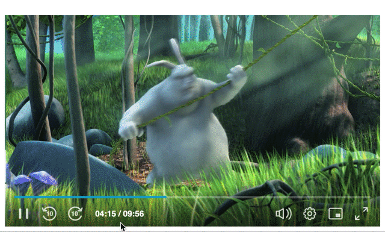
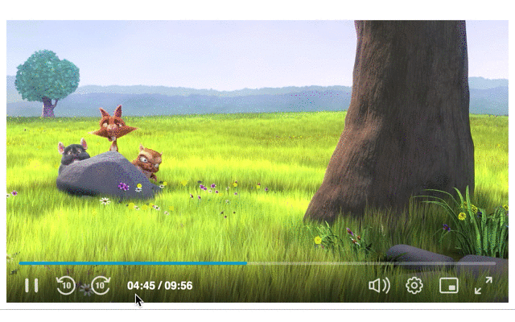
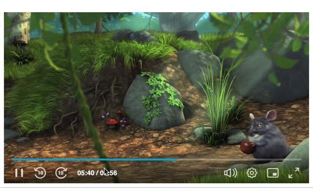

## Timeline Manager

The Timeline Manager exposes simple API's to manage custom components on the player seekbar element.  

By the Timeline Manager the app can add cue points to indicate specific points on the seekbar (e.g. ads). 
As well as to custom the thumbnail preview shown on seekbar hovering.

## API
[`addCuePoint`](#addcuepoint)  
- [Examples](#examples)  
  
[`removeCuePoint`](#removecuepoint)  
[`setSeekbarPreview`](#setseekbarpreview)  
- [Examples](#examples-1)

#### addCuePoint
Enables to add cue point to a specific position on the timeline seekbar.  
Returns an object with the cue point id, to remove the cue point by `removeCuePoint`.

> It's impossible to add cue points while LIVE playback. Returned `null`.

<table>
    <thead>
        <tr>
            <th>Param</th>
            <th>Sub Param</th>
            <th>Type</th>
            <th>Description</th>
            <th>Mandatory</th>
            <th>Default Value</th>
            <th>Notes</th>
        </tr>
    </thead>
    <tbody>
        <tr>
            <td><code>time</code></td>
            <td></td>
            <td><code>number</code></td>
            <td>The cue point time</td>
            <td>Yes</td>
            <td></td>
            <td>In seconds</td>
        </tr>
        <tr>
            <td><code>presets</code></td>
            <td></td>
            <td><code>array[string]</code></td>
            <td>The presets the cue point should be displayed</td>
            <td>No</td>
            <td>the currently active preset</td>
            <td></td>
        </tr>
        <tr>
            <td rowspan=5><code>marker</code></td>
            <td><code>get</code></td>
            <td><code>Function|string</code></td>
            <td>preact component or html tag (e.g "div")</td>
            <td>No</td>
            <td></td>
            <td>for custom marker</td>
        </tr>
        <tr>
            <td><code>props</code></td>
            <td><code>Object</code></td>
            <td>props for custom marker</td>
            <td>No</td>
            <td></td>
            <td>if <code>get</code> property used</td>
        </tr>
        <tr>
            <td><code>color</code></td>
            <td><code>string</code></td>
            <td>The marker color</td>
            <td>No</td>
            <td><code>#FFFFFFF</code></td>
            <td></td>
        </tr>
        <tr>
            <td><code>width</code></td>
            <td><code>number</code></td>
            <td>custom width</td>
            <td>No</td>
            <td><code>2px</code></td>
            <td></td>
        </tr>
        <tr>
            <td><code>className</code></td>
            <td><code>string</code></td>
            <td>The marker custom classes</td>
            <td>No</td>
            <td></td>
            <td>don't use it for width</td>
        </tr>
        <tr>
            <td rowspan=7><code>preview</code></td>
            <td><code>get</code></td>
            <td><code>Function|string</code></td>
            <td>preact component or html tag (e.g "div")</td>
            <td>No</td>
            <td>the default seekbar preview</td>
            <td>this component replaces the default preview and gets its props (e.g. <code>thumbnailURL, virtualTime</code>) as <code>props.defaultPreviewProps</code></td>
        </tr>
        <tr>
            <td><code>props</code></td>
            <td><code>Object</code></td>
            <td>props for custom preview</td>
            <td>No</td>
            <td></td>
            <td>if <code>get</code> property used</td>
        </tr>
        <tr>
            <td><code>width</code></td>
            <td><code>number</code></td>
            <td>the preview width</td>
            <td>No</td>
            <td><code>160px</code></td>
            <td></td>
        </tr>
        <tr>
            <td><code>height</code></td>
            <td><code>number</code></td>
            <td>the preview height</td>
            <td>No</td>
            <td><code>90px</code></td>
            <td></td>
        </tr>
        <tr>
            <td><code>className</code></td>
            <td><code>string</code></td>
            <td>The preview custom classes</td>
            <td>No</td>
            <td></td>
            <td>don't use it for width</td>
        </tr>
        <tr>
            <td><code>hideTime</code></td>
            <td><code>boolean</code></td>
            <td>whether to hide the time bubble</td>
            <td>No</td>
            <td><code>false</code></td>
            <td></td>
        </tr>
        <tr>
            <td><code>sticky</code></td>
            <td><code>boolean</code></td>
            <td>whether the preview is shown on hovering</td>
            <td>No</td>
            <td><code>true</code></td>
            <td></td>
        </tr>
    </tbody>
</table>

###### Examples 

1. Simple cue point without custom preview:


  
```js
kalturaPlayer.ui.getManager('timeline').addCuePoint({
  time: 400
});
```
##

2. Custom cue point with sticky preview and show time:


  
```js
.marker {
  border-radius: 4px;
}
.preview {
  background-color: white;
  color: black;
  font-size: 20px;
  text-align: center;
}

class preview extends kalturaPlayer.ui.preact.Component {
  render(props) {
    return <div {...props} />;
  }
}

kalturaPlayer.ui.getManager('timeline').addCuePoint({
  time: 300,
  marker: {
    width: 8,
    color: 'yellow',
    className: 'marker'
  },
  preview: {
    get: preview,
    props: {
      innerText: 'Cue Point Preview'
    },
    className: 'preview',
    width: 100
  }
})
```
##

3. Simple cue point with non-sticky preview and hide time:


  
```js
.preview {
  background-color: white;
  color: black;
  font-size: 20px;
  text-align: center;
}

class preview extends kalturaPlayer.ui.preact.Component {
  render(props) {
    return <div {...props}>{toTime(props.defaultPreviewProps.virtualTime)}</div>;
  }
}

kalturaPlayer.ui.getManager('timeline').addCuePoint({
  time: 200,
  preview: {
    get: preview,
    props: {
      style: {paddingTop: '33%'}
    },
    className: 'preview',
    width: 100,
    hideTime: true,
    sticky: false
  }
});
```
##


#### removeCuePoint
Enables to remove a cue point from the timeline seekbar by the cue point id returned by `addCuePoint`.

| Param 	| Type     	| Description      	| Mandatory 	| Notes                   	|
|-------	|----------	|------------------	|-----------	|-------------------------	|
| `id`  	| `string` 	| The cue point id 	| Yes       	| returned by `addCuePoint`	|


#### setSeekbarPreview
Enables to override the default seekbar preview thumbnail.  
Returns a function for restoring the default.

> Seekbar preview does not shown while LIVE playback.

| Param       	| Type               	| Description                                 	| Default Value               	| Notes                                                                                                                	          |
|-------------	|--------------------	|---------------------------------------------	|-----------------------------	|--------------------------------------------------------------------------------------------------------------------------------	|
| `get`       	| `Function\string` 	| preact component or html tag (e.g 'div')    	|                             	| this component replaces the default preview and gets its props (e.g. `thumbnailURL, virtualTime`) as `props.defaultPreviewProps`|
| `props`     	| `Object`           	| props for custom preview                    	|                             	|                                                                                                                                	|
| `presets`   	| `array[string]`    	| The presets the preview should be displayed 	| the currently active preset 	|                                                                                                                                	|
| `width`     	| `number`           	| the preview width                           	| `160px`                     	|                                                                                                                                	|
| `height`    	| `number`           	| the preview height                          	| `90px`                      	|                                                                                                                                	|
| `className` 	| `string`           	| The preview custom classes                  	|                             	| don't use it for width                                                                                                         	|
| `hideTime`  	| `boolean`          	| whether to hide the time bubble             	| `false`                     	|                                                                                                                                	|
| `sticky`    	| `boolean`          	| whether the preview is shown on hovering    	| `true`                      	|                                                                                                                                	|

###### Examples 

1. Sticky preview and show time:



```js
.preview {
  background-color: white;
  color: black;
  font-size: 20px;
  text-align: center;
}

class preview extends kalturaPlayer.ui.preact.Component {
  render(props) {
    return <div {...props} />;
  }
}

kalturaPlayer.ui.getManager('timeline').setSeekbarPreview({
  get: preview,
  props: {
    style: {paddingTop: '15%'},
    innerText: 'Seekbar Preview'
  },
  className: 'preview'
});
```
##

2. Non-sticky preview and hide time:



```js
.preview {
  background-color: white;
  color: black;
  font-size: 20px;
  text-align: center;
}

class preview extends kalturaPlayer.ui.preact.Component {
  render(props) {
    return <div {...props}>{toTime(props.defaultPreviewProps.virtualTime)}</div>;
  }
}

kalturaPlayer.ui.getManager('timeline').setSeekbarPreview({
  get: preview,
  props: {
    style: {paddingTop: '15%'}
  },
  className: 'preview',
  hideTime: true,
  sticky: false
});
```
##
